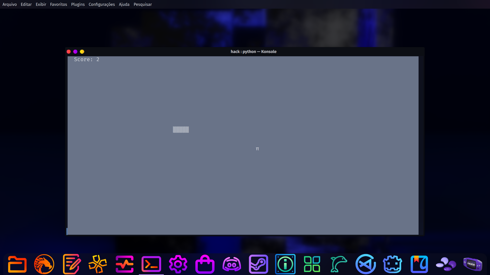

## 🏻 Tools and Skills🔗


<p>

# Snake




> Imagem mostrando uma prévia do projeto, se ficou curioso verifique os arquivos do repositório.

### Ajustes e melhorias

Basicamente o projeto foi capaz de realizar as seguintes tarefas:

- [x] Jogo funcional com os imputs das setas 1
- [x] Contador de pontos 2
- [x] Jogo rodando via terminal 3
      


## 🚀 Para rodar o jogo via terminal verifique se o Python está instalado na sua distro!

## Para instalar em uma distribuição que seja base Arch basta rodar o sequinte código:

```
sudo pacman -S python-curses
```
## Depois de instalar o python, para rodar o game via terminal basta digitar o seguinte comando:
```
python snake.py
```
